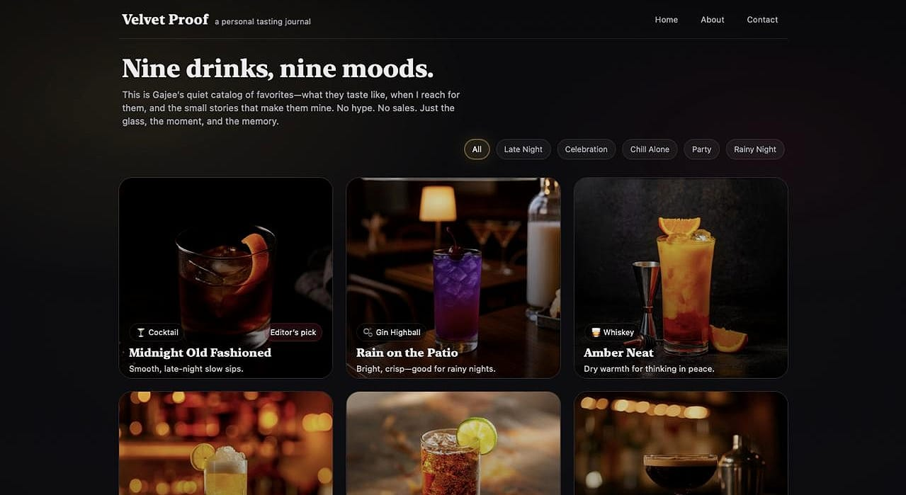
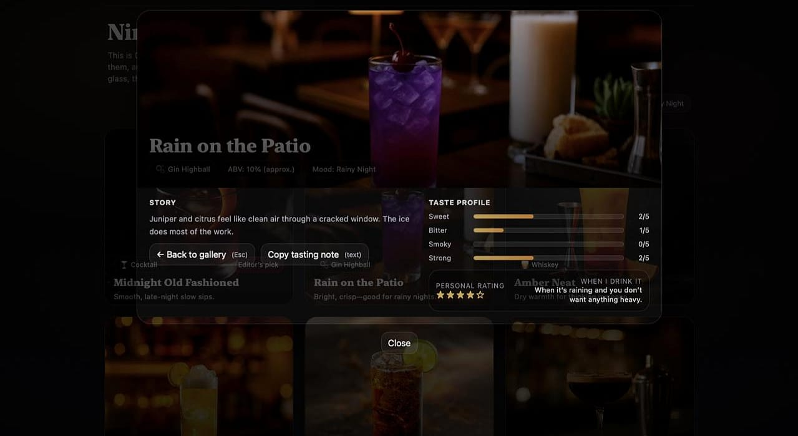

<!-- ===================================================== -->
<!--                     VELVET PROOF                      -->
<!-- ===================================================== -->

<p align="center">
  
</p>

<h1 align="center">Velvet Proof</h1>

<p align="center">
  <strong>A personal tasting journal by Gajee.</strong><br/>
  Dark, premium, minimal — a quiet catalog of drinks, moods, and memories.
</p>

<p align="center">
  <a href="https://instagram.com/gajeness" target="_blank" rel="noopener">
    
  </a>
  <a href="mailto:gajenes10@gmail.com">
    
  </a>
  
</p>

<br/>

<p align="center">
  
  &nbsp;&nbsp;
  
</p>

---

## What This Is

**Velvet Proof** is a personal drinking journal — not a review site, not a sales page, not a recommendation engine.

It’s built to capture:
- the drink  
- the mood it fits  
- the taste profile  
- the moment behind it  

A small archive of nights worth remembering.

---

## Experience

- Dark, editorial UI inspired by lounges and late-night bars  
- Premium hover interactions (soft glow, overlay, lift)  
- Mood-based filtering (vibe-first, not category-first)  
- Individual drink pages with story + taste + rating  
- Responsive layout (mobile → desktop)

---

## Tech

<p>
  
  
  
</p>

No frameworks. No dependencies.  
Just clean front-end, intentionally minimal.

---

## Setup

Clone and open locally:

```bash
# Option 1: open the HTML directly
open index.html

# Option 2 (recommended): run a tiny local server
python -m http.server 8080
